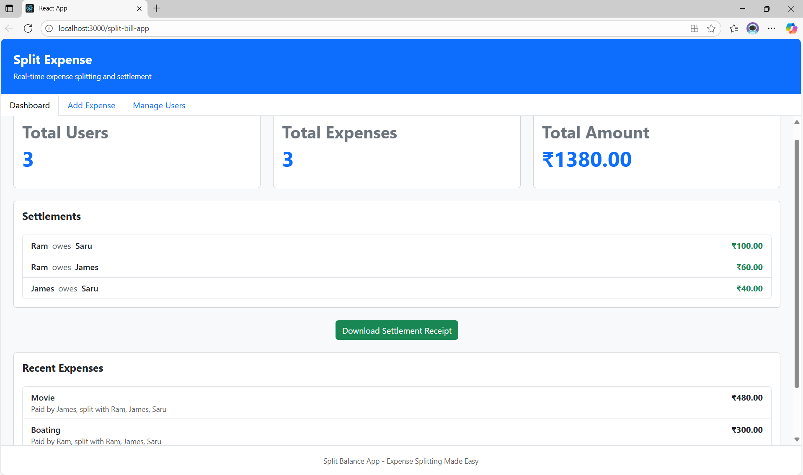
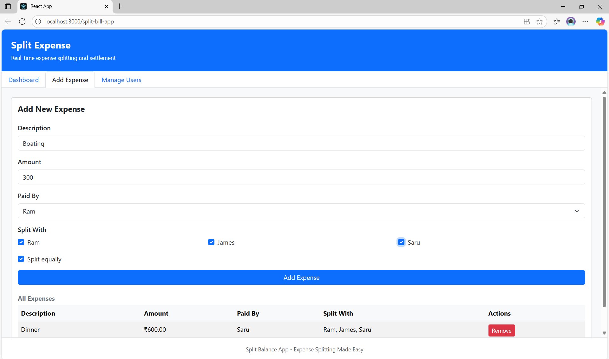
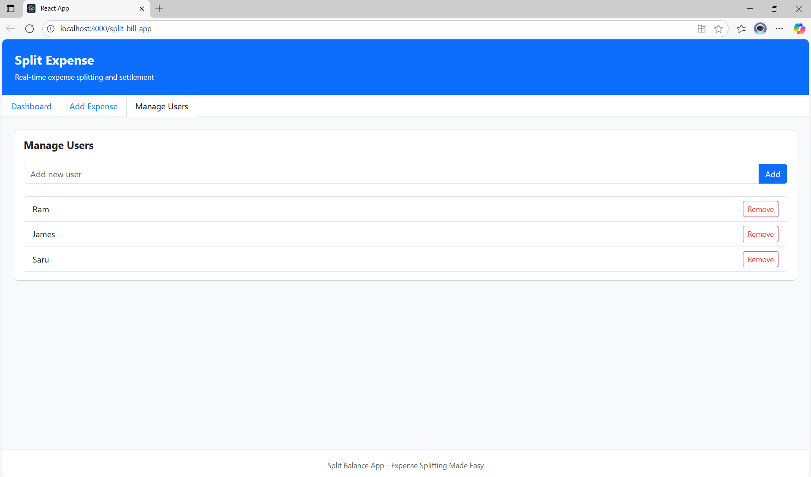
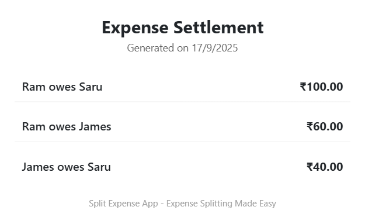

# SplitExpense
A smart bill-splitting web application inspired by Splitwise, designed to help users manage shared expenses easily and fairly.

## 📖 About the Project
Managing group expenses can be confusing who paid how much, and who owes whom?  
**SplitExpense** solves this problem by allowing users to add expenses, mark who paid, and automatically calculate fair splits among participants.  

This project is built with **React** and designed for future backend integration.

## 📸 Screenshots
### Dashboard
Overview of all expenses and balances.
 
### Add Expense
Add new expenses and assign who paid. 

### Manage Users
Easily add or manage participants.  

### Settlement Receipt
View who owes whom and download receipt.
 

## ✨ Features
- Add and manage group expenses  
- Automatic split calculation  
- Track who owes whom  
- Download settlement receipt in PNG format  
- Simple and user-friendly interface 


## 🛠️ Tech Stack
- **Frontend:** React, JavaScript, CSS/Bootstrap  
- **Future Scope:** Node.js + Express, Database (MySQL/MongoDB)

## 🚀 Getting Started

Follow these steps to set up the project locally:

### Prerequisites
- Node.js and npm installed  
- Git installed  

### Installation
```bash
git clone https://github.com/Shruti-sahu07/split-bill-app
cd SplitExpense
npm install
npm start 
```
The app will run at http://localhost:3000/

## 📂 Usage

1.Enter total expenses and select who paid.

2.Add participants and split amount equally.

3.View summary of who owes whom.

4.Download receipt for record-keeping.

## 📁 Project Structure
SplitExpense/
├── public/
├── src/
│   ├── components/
│   ├── assets/
│   └── App.js
├── package.json
└── README.md

## 🚧 Future Enhancements

User authentication (Login/Signup)

Group-wise expense tracking

Cloud storage for receipts

Dark mode UI 

<!-- 
# Getting Started with Create React App

This project was bootstrapped with [Create React App](https://github.com/facebook/create-react-app).

## Available Scripts

In the project directory, you can run:

### `npm start`

Runs the app in the development mode.\
Open [http://localhost:3000](http://localhost:3000) to view it in your browser.

The page will reload when you make changes.\
You may also see any lint errors in the console.

### `npm test`

Launches the test runner in the interactive watch mode.\
See the section about [running tests](https://facebook.github.io/create-react-app/docs/running-tests) for more information.

### `npm run build`

Builds the app for production to the `build` folder.\
It correctly bundles React in production mode and optimizes the build for the best performance.

The build is minified and the filenames include the hashes.\
Your app is ready to be deployed!

See the section about [deployment](https://facebook.github.io/create-react-app/docs/deployment) for more information.

### `npm run eject`

**Note: this is a one-way operation. Once you `eject`, you can't go back!**

If you aren't satisfied with the build tool and configuration choices, you can `eject` at any time. This command will remove the single build dependency from your project.

Instead, it will copy all the configuration files and the transitive dependencies (webpack, Babel, ESLint, etc) right into your project so you have full control over them. All of the commands except `eject` will still work, but they will point to the copied scripts so you can tweak them. At this point you're on your own.

You don't have to ever use `eject`. The curated feature set is suitable for small and middle deployments, and you shouldn't feel obligated to use this feature. However we understand that this tool wouldn't be useful if you couldn't customize it when you are ready for it.

## Learn More

You can learn more in the [Create React App documentation](https://facebook.github.io/create-react-app/docs/getting-started).

To learn React, check out the [React documentation](https://reactjs.org/).

### Code Splitting

This section has moved here: [https://facebook.github.io/create-react-app/docs/code-splitting](https://facebook.github.io/create-react-app/docs/code-splitting)

### Analyzing the Bundle Size

This section has moved here: [https://facebook.github.io/create-react-app/docs/analyzing-the-bundle-size](https://facebook.github.io/create-react-app/docs/analyzing-the-bundle-size)

### Making a Progressive Web App

This section has moved here: [https://facebook.github.io/create-react-app/docs/making-a-progressive-web-app](https://facebook.github.io/create-react-app/docs/making-a-progressive-web-app)

### Advanced Configuration

This section has moved here: [https://facebook.github.io/create-react-app/docs/advanced-configuration](https://facebook.github.io/create-react-app/docs/advanced-configuration)

### Deployment

This section has moved here: [https://facebook.github.io/create-react-app/docs/deployment](https://facebook.github.io/create-react-app/docs/deployment)

### `npm run build` fails to minify

This section has moved here: [https://facebook.github.io/create-react-app/docs/troubleshooting#npm-run-build-fails-to-minify](https://facebook.github.io/create-react-app/docs/troubleshooting#npm-run-build-fails-to-minify)
